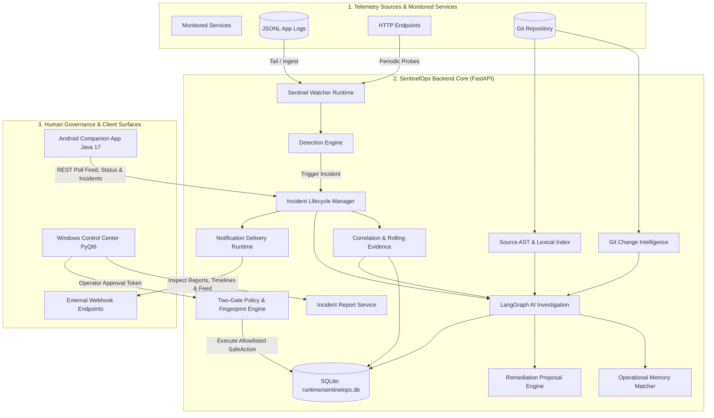

# SentinelOps

Always-on AI-assisted incident detection, investigation, operational memory, and human-controlled response for modern applications.

---

## 1. Overview

**SentinelOps** is an open reliability engineering and incident response platform that unifies real-time application monitoring, deterministic symptom detection, AI-assisted root-cause investigation, historical operational memory, and policy-governed safe actions into a structured, incident-centric workflow.

In complex software systems, resolving production incidents often involves significant cognitive load: monitoring alerts fire across disparate dashboards, raw logs are searched manually, Git histories are navigated through separate tools, and institutional memory regarding past outages remains fragmented across postmortems and chat channels.

SentinelOps addresses this fragmentation by organizing runtime symptoms, source code structure, Git change history, and past incident context around a canonical incident lifecycle. The system continuously observes monitored services, detects operational anomalies, correlates surrounding telemetry evidence, executes an evidence-grounded investigation workflow, matches prior operational cases for historical context, prepares structured remediation proposals, dispatches notifications, and permits bounded operational actions under explicit human approval.

### The Safety Philosophy

SentinelOps is built on the principle that **human governance is an intentional architectural safety control**:

SentinelOps is **not** an autonomous operations bot, an unconstrained self-healing daemon, or an unrestricted shell executor. The platform enforces an unambiguous separation of responsibilities:

```text
DETECT  ──►  UNDERSTAND  ──►  EXPLAIN  ──►  REMEMBER  ──►  RECOMMEND  ──►  NOTIFY  ──►  OPTIONAL HUMAN-APPROVED ACTION
```

- **Sentinel Watcher**: Observes streaming logs and connector endpoints to detect anomalies and trigger incidents.
- **Sentinel Engine / Investigation**: Synthesizes probable root causes grounded in retrieved runtime evidence and indexed source code.
- **Operational Memory**: Retrieves historical incident records sharing categorical and lexical similarities to surface prior resolutions.
- **Remediation Engine**: Generates advisory repair recommendations and validation checks without modifying code automatically.
- **Policy Engine**: Enforces strict deny-by-default allowlisting and cryptographic SHA-256 parameter fingerprint validation.
- **Human Operator**: Explicit human confirmation is required before any operational action executes or any Git branch is prepared.

---

## 2. System Architecture & How It Works

SentinelOps connects telemetry sources, an asynchronous backend engine, durable SQLite persistence, a desktop operational control center, and a companion Android mobile app:



---

## 3. Product Surfaces

SentinelOps provides operational interfaces across desktop, backend, and mobile surfaces:

### Sentinel Watcher
The always-on monitoring runtime hosted within the backend process. It tails application JSONL log streams, polls external HTTP endpoints via registered connectors, validates payload structures, buffers incoming telemetry events, evaluates deterministic detection rules, and triggers automated incident creation.

### Sentinel Engine
The core backend intelligence service built with FastAPI. It maintains canonical incident state machines, correlates rolling evidence windows, manages AST-based project code indexes, analyzes Git commit histories, orchestrates multi-step LangGraph investigations, matches past incidents in operational memory, generates advisory remediation plans, enforces safe-action policies, delivers webhook notifications, and generates reproducible post-incident reports.

### Windows Control Center
A desktop application built with PyQt6 designed for engineers conducting incident triage. It provides multi-project switching, live health status, incident filtering, investigation exploration, evidence log inspection, Git diff review, remediation inspection, SafeAction approval workflows, post-incident report generation with Markdown export, and historical operational memory comparison.

### Android Companion Client
A native companion application (`com.sentinelops.mobile` in Java 17 / Retrofit / Material Design) designed for mobile operational awareness. It provides connectivity status, project switching, incident lifecycle exploration, connector monitoring, notification feed review, and evidence inspection. The mobile app interacts with the engine via REST polling.

---

## 4. Key Capabilities

- **Continuous Telemetry & Health Monitoring**: Asynchronous log tailing, HTTP health probes, and webhook ingestion with authentication and external event deduplication.
- **Deterministic Incident Detection**: Rule-based detection evaluating normalized telemetry against three prioritized deterministic rules: synthetic health probe failures (`rule.health_check_failed`), application error logs and unhandled exceptions (`rule.app_error`), and server-side HTTP 5xx responses (`rule.http_5xx`). (No sliding frequency windows or count thresholds are evaluated).
- **Evidence Correlation & Time-Windowing**: Automatic assembly of rolling log events surrounding failure timestamps.
- **Multi-Project Workspaces**: Logical project workspaces with canonical path resolution, metadata persistence, and boundary enforcement.
- **Source Code AST Indexing**: Recursive Python AST parsing extracting classes, functions, and endpoints into an in-memory lexical code index.
- **Git Change Intelligence**: Read-only subprocess Git client analyzing recent commits, commit metadata, changed files, and patch diffs with `--` pathspec safety.
- **Evidence-Grounded AI Investigation**: Multi-node LangGraph orchestration combining runtime symptoms, source code chunks, and Git commits into structured root-cause hypotheses with grounding verification.
- **Durable Operational Memory**: Persistent SQLite storage of resolved incident contexts using deterministic categorical and Jaccard lexical scoring to retrieve similar past failures.
- **Advisory Remediation Proposals**: Actionable repair plans containing problem summaries, proposed source code diffs, rationale, risks, and validation checks.
- **Strict Safe Action Framework**: Bounded operational action framework with SHA-256 parameter fingerprinting, dual policy gates, and active-target concurrency locking.
- **Deterministic Incident Reports & Timelines**: Post-restart survivable report generation unifying evidence, investigation, remediation, notifications, and immutable audit logs.
- **Multi-Device Notifications**: Webhook delivery with exponential backoff and HMAC-SHA256 signatures, alongside desktop and Android notification feeds.
- **Security Hardening**: Pre-resolution SSRF protection, strict Git argument validation, workspace path jail, streaming body-size limits, security response headers, and secret scrubbing.

---

## 5. End-to-End Incident Lifecycle

Every incident in SentinelOps traverses an explicit lifecycle:

```text
Telemetry Event ──► Detection Rule ──► Incident Created (OPEN)
                          │
                          ▼
               Evidence Window Correlated
                          │
                          ▼
            Status Updated (INVESTIGATING)
                          │
                          ▼
               LangGraph AI Investigation
          (Runtime + Source AST + Git Diff)
                          │
                          ▼
            RCA Synthesized & Validated
                          │
                          ▼
             Operational Memory Matched
                          │
                          ▼
           Remediation Proposal Formulated
                          │
                          ▼
           Notification Dispatched (Webhook/Feed)
                          │
                          ▼
      [Human Operator Reviews via Desktop UI]
                          │
                          ▼
     Policy Gate #1 ──► Human Approval ──► Policy Gate #2
                          │
                          ▼
          Safe Action Execution (Allowlisted)
                          │
                          ▼
        Incident Resolved / Closed (RESOLVED/CLOSED)
                          │
                          ▼
      Incident Report & Factual Timeline Generated
```

*Note: Incidents can be resolved directly at any point; remediation proposals and safe actions are optional advisory/diagnostic steps.*

---

## 6. AI Investigation & Operational Memory

### LangGraph Investigation Workflow

SentinelOps orchestrates AI-assisted investigations using a multi-node LangGraph state machine:

1. `load_context` / `analyze_runtime`: Ingests correlated telemetry events to extract symptoms, affected services, HTTP routes, and exception types.
2. `retrieve_code`: Constructs targeted lexical queries from exception concepts and queries the project's source code index.
3. `analyze_code`: Evaluates retrieved source chunks to identify candidate execution paths and relevant methods.
4. `retrieve_git_context`: Gathers recent commits and diffs touching the candidate source files.
5. `analyze_changes`: Evaluates whether recent code changes correlate with the failure mechanism without assuming temporal correlation implies causation.
6. `synthesize_rca`: Generates an evidence-grounded Root Cause Analysis (RCA) citing runtime evidence IDs, code chunk IDs, and Git commit hashes.
7. `validate_rca`: Performs validation auditing the synthesis for uncited claims, unreferenced components, or missing citations.
8. `revise_rca`: Triggers a bounded revision loop if validation fails, restricted strictly to existing evidence.

> **Evaluation Notice:** AI outputs are probabilistic hypotheses and investigative aids. They do not constitute guaranteed facts and should be verified by engineering operators.

### Operational Memory (Similar Incidents)

When investigating an incident, SentinelOps queries its durable `incident_memory` SQLite repository:
- Historical incident records are indexed with categorical metadata (service, exception type, endpoint, symbols) and textual summaries.
- The matching engine (`IncidentMemoryMatcher` in `app/memory/matcher.py`) computes a deterministic composite score:
  - **Service Match**: `+3.0`
  - **Exception Type Match**: `+4.0`
  - **Endpoint Match**: `+2.0`
  - **Symbol / Failure Location Overlap**: `+5.0`
  - **Lexical Overlap**: Token Jaccard similarity multiplied by 3.0 (`jaccard * 3.0`)
- Candidates reaching a score threshold ($\ge 3.0$) are ranked deterministically by score descending, then incident ID ascending.
- The incident currently under investigation is excluded from its own search results.

---

## 7. Remediation & The Safe Action Boundary

SentinelOps maintains an architectural boundary between **advisory recommendations** and **active execution**:

### What SentinelOps Can Do
1. **Generate Remediation Proposals**: Produces structured text proposals detailing recommended code repairs, risk assessments, affected files, and verification test steps.
2. **Execute Allowlisted SafeActions**: Allows operators to trigger strictly allowlisted, low-risk diagnostic or recovery tasks through the `SafeAction` framework:
   - `TEST_CONNECTOR`: Non-mutating diagnostic connectivity check against an established telemetry connector.
   - `RETRY_NOTIFICATION`: Re-enqueuing a failed notification for delivery.

### What SentinelOps CANNOT Do
To prevent unintended side effects, SentinelOps enforces the following constraints:
- **NO arbitrary shell execution**
- **NO unconstrained CLI command execution**
- **NO autonomous production modifications**
- **NO automatic code deployment or merging**
- **NO unrestricted self-healing routines**

### Dual-Gated Policy Lifecycle

Every executable action must satisfy two distinct policy validation passes:
1. **Policy Gate #1 (Proposal Time)**: Validates target registration, action allowlisting, parameter immutability, and generates a deterministic SHA-256 fingerprint snapshot.
2. **Human Approval**: The operator explicitly approves the action, storing an approval record matching the proposed fingerprint.
3. **Policy Gate #2 (Execution Time)**: Re-validates that the target remains active and the incident is non-terminal, confirms the fingerprint matches the approved snapshot, acquires a concurrency lock on the target in SQLite, executes the allowlisted Python executor, and records an append-only audit record.

---

## 8. Security Model

SentinelOps implements defense-in-depth security across network boundaries, subprocesses, filesystems, and HTTP transports:

- **SSRF Defense (`SSRFGuard`)**: Enforces multi-record DNS resolution immediately before outbound network requests in connector testing, polling, and webhook delivery. Blocks cloud metadata endpoints (`169.254.169.254`, `fd00:ec2::254`, `metadata.google.internal`), link-local IPs (`169.254.0.0/16`, `fe80::/10`), multicast ranges, and IPv4-mapped IPv6. In `APP_ENV=production`, blocks loopback and RFC 1918 private subnets unless explicitly allowlisted via `ALLOWED_INTERNAL_HOSTS`. *(Note: Pre-resolution validates destination addresses prior to connection; in environments with unpinned sockets, standard HTTP clients retain theoretical residual DNS rebinding TOCTOU windows if external DNS changes dynamically).*
- **Redirect Controls**: Outbound HTTP clients configure `follow_redirects=False` by default, preventing redirect-based SSRF evasion.
- **Git Argument & Grammar Hardening**: Git branch names, commit hashes, and file paths pass through strict validators (`GitArgumentValidator`). Parameters starting with `-` are rejected to prevent flag injection. Positional `--` pathspec delimiters separate revisions/options from pathspecs on diff and log commands while preserving valid syntax for branch checkout.
- **Filesystem Boundary Safety (`PathJail`)**: Canonical path verification (`target.relative_to(workspace_root)`) prevents directory traversal. Candidate files and directories are inspected prior to resolution, ensuring symlinks and Windows NTFS directory junctions resolving outside the workspace are pruned during scanning.
- **Streaming Body-Size Caps**: ASGI middleware (`ContentLengthAndStreamLimitMiddleware`) enforces maximum request body sizes (`MAX_REQUEST_BODY_SIZE`, 10 MB default) against both `Content-Length` headers and cumulative chunked streaming payloads, mitigating memory exhaustion.
- **Security Response Headers**: `SecurityHeadersMiddleware` emits:
  - `X-Content-Type-Options: nosniff`
  - `X-Frame-Options: DENY`
  - `Referrer-Policy: strict-origin-when-cross-origin`
  - `Content-Security-Policy: default-src 'self'`
- **Conditional HSTS**: `Strict-Transport-Security` is conditionally emitted only when the request scheme is native HTTPS (`scope["scheme"] == "https"`), or when `FORCE_HTTPS=true` is set and the request arrives from a trusted proxy in `TRUSTED_PROXIES` with header `X-Forwarded-Proto: https`. It is never emitted on plain local HTTP.
- **Structured Error Sanitization**: Unhandled 500 exceptions return structured JSON errors with a unique `trace_id` while suppressing internal drive paths and stack traces from API consumers.
- **Secret Scrubbing**: Connector configurations, diagnostic responses, and webhook delivery logs pass through regex-based scrubbing to mask passwords, private keys, bearer tokens, and credentials.

---

## 9. Technology Stack

### Backend Platform
- **Language**: Python 3.11+ (`requires-python = ">=3.11"`)
- **Web Framework**: FastAPI `>=0.110.0`, Starlette
- **ASGI Server**: Uvicorn `>=0.28.0`
- **Data Modeling**: Pydantic v2 `>=2.6.0`
- **HTTP Client**: HTTPX `>=0.27.0`
- **Persistence**: SQLite 3 (WAL mode enabled via `PRAGMA journal_mode = WAL;`, foreign keys enforced per store via `PRAGMA foreign_keys = ON;`)
- **AI Orchestration**: LangGraph, LangChain Core (supports offline deterministic mock provider and live LLM integration)

### Windows Control Center
- **Framework**: PyQt6 `>=6.6.0`
- **Packaging**: PyInstaller `>=6.0.0`

### Android Companion Client
- **Platform**: Android SDK (compileSdk 34, minSdk 26, targetSdk 34)
- **Language & Runtime**: Java 17, AndroidX
- **Networking**: Retrofit `2.11.0`, OkHttp `4.12.0`, Gson `2.11.0`
- **Architecture**: MVVM, LiveData, ViewBinding, Navigation Component

### Build & Packaging
- **Build System**: `setuptools >=65.0.0`, `wheel >=0.40.0`, `build >=1.0.0`
- **Manifest Engine**: `MANIFEST.in` (enforcing sdist and wheel exclusion hygiene)

---

## 10. Repository Structure

```text
SentinelOps/
├── app/                             # Core backend engine
│   ├── actions/                     # SafeAction framework, policy engine, store, executors
│   ├── agents/                      # LLM investigation models, prompts, grounding, service
│   ├── api/                         # FastAPI router aggregation & health check
│   │   ├── health.py                # GET /health endpoint
│   │   └── __init__.py              # Aggregates sub-routers into api_router
│   ├── cli.py                       # Standalone backend CLI entry point (`sentinelops`)
│   ├── common/                      # Config, logging, security controls, middleware
│   │   ├── config.py                # Central AppConfig dataclass loaded from environment
│   │   ├── logging.py               # Masked structured logging configuration
│   │   ├── middleware.py            # SecurityHeadersMiddleware & stream size limiters
│   │   └── security.py              # SSRFGuard, PathJail, GitArgumentValidator
│   ├── connectors/                  # HTTP poller & webhook connectors, deduplication, store
│   ├── correlation/                 # Event correlation engine & time windowing
│   ├── detection/                   # Deterministic detection rules & engine
│   ├── incidents/                   # Incident state machine, models, repository, service
│   ├── knowledge/                   # Project knowledge base service & route detection
│   ├── main.py                      # FastAPI application factory & lifespan manager
│   ├── memory/                      # Operational memory matcher, models, repository, service
│   ├── notifications/               # Subscriptions, delivery worker, HMAC signing, store
│   ├── projects/                    # Project onboarding, workspace storage, scanner
│   ├── remediation/                 # Repair proposals, review & branch repositories
│   ├── reports/                     # Report generation & factual timeline service
│   ├── repository/                  # Git subprocess client, branch manager, models, routes
│   ├── retrieval/                   # Python AST parser, scanner, lexical search index
│   ├── storage/                     # Storage helpers
│   ├── telemetry/                   # Ingestion models, evidence repository, service, routes
│   ├── validation/                  # Validation utilities
│   ├── watcher/                     # Ring buffer log watcher, file & health collectors, store
│   └── workflows/                   # LangGraph investigation graph & state definitions
├── desktop/                         # Windows Control Center (PyQt6 Desktop Application)
│   ├── api/                         # Desktop API client (`client.py`), models, exceptions
│   ├── config.py                    # Desktop configuration & JSON file persistence
│   ├── control_center.spec          # PyInstaller standalone build specification
│   ├── main.py                      # Desktop launcher (supports --url, --config)
│   ├── package_control_center.py    # Desktop packaging runner script
│   ├── state/                       # App state (`app_state.py`) & Qt signals
│   ├── ui/                          # UI components (`header`, `sidebar`, `toast`) & views
│   └── workers/                     # Async background pollers & task runners
├── android/                         # Native Android companion application
│   ├── app/src/main/java/com/sentinelops/mobile/
│   │   ├── api/                     # Retrofit ApiService & network client
│   │   ├── data/                    # Incident, notification, project repositories & DTOs
│   │   ├── di/                      # ServiceLocator dependency injection
│   │   └── ui/                      # Fragments (Overview, Incidents, Connectors, Notifications)
│   ├── build.gradle                 # Root Android Gradle build script
│   └── gradlew.bat                  # Gradle wrapper
├── demo_app/                        # Failure injection microservice for testing & verification
├── tests/                           # Complete automated pytest suite (494 tests)
├── docs/
│   └── PROJECT_JOURNAL.md           # Engineering journal detailing stages 0–20
├── pyproject.toml                   # PEP 517/621 packaging metadata & CLI script
├── MANIFEST.in                      # Distribution archive exclusion rules
├── project.md                       # Master architecture specification
└── README.md                        # Project documentation
```

---

## 11. Installation & Setup

### Prerequisites
- Python 3.11 or higher
- Git command-line client installed on system `PATH`

### 1. Clone & Virtual Environment Setup

**Windows (PowerShell):**
```powershell
git clone https://github.com/Dev-Harsh773/SentinelOps.git
cd SentinelOps
python -m venv .venv
.\.venv\Scripts\Activate.ps1
```

**Linux / macOS:**
```bash
git clone https://github.com/Dev-Harsh773/SentinelOps.git
cd SentinelOps
python3 -m venv .venv
source .venv/bin/activate
```

### 2. Install Dependencies

Install the core package in editable mode with development and build dependencies:

```bash
pip install -e ".[dev,build]"
```

### 3. Environment Configuration

The application loads configuration from system environment variables or automatically from a `.env` file in the working directory via `python-dotenv`:

**Option A: Using `.env` file (copied from `.env.example`):**
```powershell
# PowerShell
Copy-Item .env.example .env

# Bash
cp .env.example .env
```

**Option B: Setting environment variables directly in shell:**

**PowerShell:**
```powershell
$env:APP_NAME = "sentinelops"
$env:APP_ENV = "development"
$env:LOG_LEVEL = "INFO"
$env:HOST = "127.0.0.1"
$env:PORT = "8000"
$env:LLM_PROVIDER = "mock"
$env:WATCHER_ENABLED = "true"
$env:WATCHER_DB_PATH = "runtime/sentinelops.db"
$env:MAX_REQUEST_BODY_SIZE = "10485760"
$env:FORCE_HTTPS = "false"
```

**Bash:**
```bash
export APP_NAME="sentinelops"
export APP_ENV="development"
export LOG_LEVEL="INFO"
export HOST="127.0.0.1"
export PORT="8000"
export LLM_PROVIDER="mock"
export WATCHER_ENABLED="true"
export WATCHER_DB_PATH="runtime/sentinelops.db"
export MAX_REQUEST_BODY_SIZE="10485760"
export FORCE_HTTPS="false"
```

---

## 12. Running the Applications

### 1. Starting the Backend Server

Launch the backend using the packaged CLI entry point:

```bash
sentinelops --host 127.0.0.1 --port 8000 --env development
```

Or run directly with Uvicorn:

```bash
uvicorn app.main:app --host 127.0.0.1 --port 8000 --reload
```

Verify the health probe:
```bash
curl http://127.0.0.1:8000/health
# {"status":"ok","service":"sentinelops"}
```

- **Interactive OpenAPI Documentation**: `http://127.0.0.1:8000/docs`

### 2. Starting the Windows Control Center

**From Source (Development Mode):**
```powershell
python desktop/main.py --url http://127.0.0.1:8000
```

**From Packaged Standalone Executable:**
```powershell
.\dist\SentinelOpsControlCenter\SentinelOpsControlCenter.exe --url http://127.0.0.1:8000
```

*Supported CLI flags:*
- `--url <backend_url>`: Override the default backend API address (default: `http://127.0.0.1:8000`).
- `--config <path>`: Load configuration from a custom JSON path (default: `%APPDATA%\SentinelOps\desktop_config.json`).
- `--help`: Display available command-line options.

### 3. Building the Android Companion Client

The mobile companion app is located in `android/`:
1. Open the `android/` directory in Android Studio.
2. Ensure JDK 17 is configured under Gradle settings.
3. Build the debug APK via the command line:
   ```powershell
   cd android
   .\gradlew.bat assembleDebug
   ```
4. Install to an attached device or emulator:
   ```powershell
   .\gradlew.bat installDebug
   ```

*Note: In debug builds, the app connects to local development endpoints (e.g., `http://10.0.2.2:8000` for Android emulator or local LAN IP).*

---

## 13. Configuration Reference

Key settings configurable via environment variables (`app/common/config.py`):

| Variable | Default | Purpose |
|---|---|---|
| `APP_NAME` | `sentinelops` | Logical name of the backend platform service. |
| `APP_ENV` | `development` | Environment mode (`development` permits localhost loopback for connectors; `production` enforces private RFC 1918 blocks). |
| `LOG_LEVEL` | `INFO` | Console logging verbosity (`DEBUG`, `INFO`, `WARNING`, `ERROR`). |
| `HOST` | `127.0.0.1` | Default bind address for the API server. |
| `PORT` | `8000` | Default bind port for the API server. |
| `LLM_PROVIDER` | `mock` | LLM investigation provider (`mock` for deterministic offline testing, `openai` for live API). |
| `LLM_MODEL` | `gpt-4o-mini` | Model identifier when using live LLM provider. |
| `OPENAI_API_KEY` | *(None)* | OpenAI API key (leave blank when using `mock`). |
| `WATCHER_ENABLED` | `true` | Enables background log-tailing and connector execution. |
| `WATCHER_DB_PATH` | `runtime/sentinelops.db` | Path to persistent SQLite database file. |
| `WATCHER_POLL_INTERVAL_SECONDS` | `1.0` | Polling frequency for watcher log inspection. |
| `MAX_REQUEST_BODY_SIZE` | `10485760` | Maximum request body limit in bytes (10 MB cap). |
| `ALLOWED_INTERNAL_HOSTS`| `""` | Comma-separated host allowlist bypassing SSRF private-range blocks in production. |
| `FORCE_HTTPS` | `false` | Enables conditional HSTS emission behind trusted proxies. |
| `TRUSTED_PROXIES` | `127.0.0.1,::1` | Comma-separated IPs of trusted reverse proxies for forwarded HTTPS headers. |

---

## 14. API Overview

The SentinelOps backend exposes modular endpoints registered in `app/api/__init__.py`:

| Domain | Method | Endpoint | Description |
|---|---|---|---|
| **Health** | `GET` | `/health` | Health probe returning `{"status":"ok","service":"sentinelops"}`. |
| **Incidents** | `GET`, `POST` | `/incidents` | List and create operational incidents. |
| | `GET` | `/incidents/{incident_id}` | Retrieve incident details and status. |
| | `PATCH` | `/incidents/{incident_id}/status` | Transition incident lifecycle state. |
| | `POST` | `/incidents/{incident_id}/investigate` | Trigger LangGraph AI root-cause investigation. |
| | `GET` | `/incidents/{incident_id}/investigation` | Retrieve investigation findings and RCA. |
| | `GET` | `/incidents/{incident_id}/report?project_id=...` | Retrieve unified post-incident report and timeline. |
| | `POST` | `/incidents/{incident_id}/evidence/collect` | Collect and attach evidence to an incident. |
| | `GET` | `/incidents/{incident_id}/evidence` | List evidence linked to an incident. |
| | `POST`, `GET` | `/incidents/{incident_id}/remediation` | Propose and retrieve remediation plans. |
| | `POST`, `GET` | `/incidents/{incident_id}/remediation/reviews` | Create and list human remediation reviews. |
| | `POST`, `GET` | `/incidents/{incident_id}/remediation/branch` | Prepare and inspect isolated Git patch branch. |
| **Actions** | `POST` | `/actions/propose` | Propose an allowlisted SafeAction with SHA-256 fingerprint. |
| | `GET` | `/actions` | List registered SafeActions. |
| | `GET` | `/actions/{action_id}` | Retrieve SafeAction details. |
| | `POST` | `/actions/{action_id}/approve` | Approve SafeAction with matching fingerprint. |
| | `POST` | `/actions/{action_id}/reject` | Reject SafeAction. |
| | `POST` | `/actions/{action_id}/execute` | Revalidate policy and execute allowlisted SafeAction. |
| | `GET` | `/actions/{action_id}/audit` | Retrieve audit log for SafeAction. |
| **Connectors** | `GET`, `POST` | `/connectors` | List and create telemetry connectors. |
| | `GET`, `PUT`, `DELETE` | `/connectors/{connector_id}` | Retrieve, update, or remove connector. |
| | `POST` | `/connectors/{connector_id}/ingest` | Ingest webhook telemetry events. |
| | `POST` | `/connectors/{connector_id}/collect` | Trigger on-demand HTTP poller collection. |
| | `POST` | `/connectors/{connector_id}/test` | Execute non-mutating connectivity probe. |
| **Notifications** | `GET` | `/notifications` | List notifications feed. |
| | `GET` | `/notifications/{notification_id}` | Retrieve notification details. |
| | `PATCH` | `/notifications/{notification_id}/read` | Mark notification as read. |
| | `POST` | `/notifications/mark-all-read` | Mark all notifications read. |
| | `POST` | `/notifications/{notification_id}/retry` | Reset a failed notification to 'pending' to trigger delivery worker (can also be invoked via Stage 18 SafeAction `RETRY_NOTIFICATION` under two-gate approval). |
| | `GET`, `POST` | `/notifications/subscriptions` | List and create notification subscriptions. |
| | `GET`, `PATCH`, `DELETE`| `/notifications/subscriptions/{subscription_id}`| Manage subscription configuration. |
| | `POST` | `/notifications/subscriptions/{subscription_id}/test`| Send diagnostic ping to webhook subscriber. |
| **Projects** | `GET`, `POST` | `/projects` | List and register project workspaces. |
| | `GET`, `DELETE` | `/projects/{project_id}` | Retrieve or delete project configuration. |
| | `POST` | `/projects/{project_id}/reindex` | Trigger AST re-indexing for project workspace. |
| | `GET` | `/projects/{project_id}/knowledge` | Retrieve project knowledge base overview. |
| | `POST` | `/projects/{project_id}/search` | Search project knowledge base. |
| **Repository** | `POST` | `/repository/index` | Index workspace source code AST chunks. |
| | `GET` | `/repository/status` | Check source indexing status. |
| | `POST` | `/repository/search` | Search indexed source symbols and chunks. |
| **Git** | `GET` | `/git/commits` | List recent commits with pathspec safety. |
| | `GET` | `/git/commits/{commit_hash}` | Get details for a specific commit. |
| | `GET` | `/git/commits/{commit_hash}/diff` | Get commit patch diff. |
| | `GET` | `/git/files/history` | Inspect commit history for specific file. |
| **Memory** | `GET` | `/memory` | List stored incident memory records. |
| | `GET` | `/memory/{incident_id}` | Retrieve memory record for specific incident. |
| | `POST` | `/memory/search` | Search historical memory via categorical/Jaccard matcher. |
| **Watcher** | `GET` | `/watcher/status` | Check watcher runtime status. |
| | `GET`, `POST` | `/watcher/events` | List or manually submit watcher events. |
| **Telemetry** | `POST` | `/telemetry/logs` | Ingest streaming application logs. |

---

## 15. Testing & Verification

The repository contains an automated regression suite covering functionality across Stages 0 through 20:

```bash
python -m pytest tests/ -q
```

**Current Verified Baseline:**
```text
494 passed in 102.10s
```

### Running Specific Test Suites

- **Stage 20 Security Hardening**:
  ```bash
  python -m pytest tests/test_stage20_security_hardening.py -v
  ```
  *(20 passed: SSRF checks, Git argument validation, PathJail symlink/junction boundary checks, headers, request caps, error sanitization, secret scrubbing)*

- **Packaging Smoke Tests**:
  ```bash
  python -m pytest tests/test_desktop_packaging_smoke.py -v
  ```
  *(2 passed: Verifies standalone Windows executable execution and asserts archive exclusions for `.whl` and `.tar.gz`)*

- **Incident Persistence & Restart Survival**:
  ```bash
  python -m pytest tests/test_incidents_persistence.py tests/test_reports_persistence.py -v
  ```

---

## 16. Packaging & Distribution

Stage 20 established reproducible packaging for both the backend distribution and the desktop application:

### Backend Distribution (Wheel & Source Distribution)

Build standard distribution archives:

```bash
python -m build --sdist --wheel
```

- **Wheel**: `dist/sentinelops-0.20.0-py3-none-any.whl`
- **Source Distribution**: `dist/sentinelops-0.20.0.tar.gz`
- **Exclusion Hygiene**: Both archives exclude `tests/`, `android/`, `.env*`, `runtime/*.db*`, and `runtime/*.jsonl` files via `MANIFEST.in` and `pyproject.toml`.

### Windows Control Center (Standalone Executable)

Package the standalone desktop application using PyInstaller:

```powershell
python desktop/package_control_center.py
```

- **Output Folder**: `dist/SentinelOpsControlCenter/`
- **Main Binary**: `dist/SentinelOpsControlCenter/SentinelOpsControlCenter.exe`
- **Hygiene**: The distribution directory contains no development database files, logs, or secrets.

---

## 17. Completed Roadmap — Stages 0–20

| Stage | Focus | Milestone / Verified Deliverable |
|:---:|---|---|
| **0** | Foundation | Modular FastAPI architecture, configuration, logging, and health probe. |
| **1** | Incident Management | Deterministic in-memory incident lifecycle state machine (`OPEN` $\to$ `INVESTIGATING` $\to$ `RESOLVED` $\to$ `CLOSED`). |
| **2** | Demo Application | Standalone microservice with controllable failure injection endpoints. |
| **3** | Telemetry & Evidence | Structured runtime log ingestion and evidence linking. |
| **4** | Source Indexing | Deterministic AST parsing and lexical code chunk retrieval index. |
| **5** | Git Intelligence | Read-only subprocess Git client analyzing commits, diffs, and file histories. |
| **6** | AI Investigation | Multi-node LangGraph orchestration synthesizing evidence-grounded root cause analyses. |
| **7** | Incident Memory | Deterministic categorical and Jaccard lexical scoring over historical incidents for past operational context. |
| **8** | Remediation Proposals | Structured code repair proposals with risk analyses and validation steps. |
| **9** | Human Approval & Branches | Read-only human review workflows and isolated Git branch preparation. |
| **10** | Sentinel Watcher | Always-on background log buffer and continuous telemetry ingestion runtime. |
| **11** | Detection Rules | Deterministic detection rules triggering automatic incident creation. |
| **12** | Event Correlation | Rolling evidence windows correlating surrounding telemetry around failure timestamps. |
| **13** | Project Knowledge Base | Multi-project workspaces with route detection and canonical path handling. |
| **14** | Telemetry Connectors | HTTP poller and webhook connectors with deduplication and secret masking. |
| **15** | Notification Subsystems | Webhook delivery engine with HMAC-SHA256 signatures, backoff, and feed APIs. |
| **16** | Windows Control Center | Desktop client (PyQt6) for triage, telemetry review, and approval operations. |
| **17** | Android Client | Native companion app (`com.sentinelops.mobile` in Java 17 / Retrofit) for mobile status awareness. |
| **18** | Safe Action Framework | SHA-256 parameter fingerprinting, dual policy gates, and allowlisted actions (`TEST_CONNECTOR`, `RETRY_NOTIFICATION`). |
| **19** | Reports & Operational Memory UX | Durable post-incident report generation, deterministic timelines, and memory UI tabs. |
| **20** | Security, Hardening & Packaging | SSRF defenses, Git argument validation, PathJail, streaming caps, headers, Wheel, sdist, and PyInstaller bundling. |

---

## 18. Current Project Status & Engineering Limitations

The planned Stage 0–20 development roadmap is complete, and the repository is in a verified baseline with 494 automated tests passing.

### Technical & Operational Considerations

- **Probabilistic AI Root-Cause Analysis**: LLM investigations synthesize probable hypotheses from available evidence. While validated against hallucinated symbols and uncited claims, root-cause analyses are decision aids and should not be treated as infallible truth.
- **Source Retrieval Dependency**: Investigation quality is bounded by the quality and relevance of indexed source chunks. Unrelated chunks can occasionally be retrieved if lexical queries match non-causal symbols.
- **Strictly Bounded Safe Actions**: SentinelOps intentionally does not provide arbitrary shell execution or automatic code deployment. Actions are restricted strictly to allowlisted diagnostic and recovery operations (`TEST_CONNECTOR`, `RETRY_NOTIFICATION`).
- **Residual DNS Rebinding Considerations**: Outbound SSRF defense resolves and validates IP addresses immediately before network transmission. In environments using standard HTTP connection pools, a residual TOCTOU window exists if external authoritative DNS dynamically alters records between check and socket connection.
- **Local SQLite Architecture**: The current storage engine uses SQLite in WAL mode. While robust for workstation and single-node server deployments, multi-region or distributed high-availability clustering is not natively supported.

---

## 19. Authoritative Documentation

For technical implementation history, stage logs, and deep architectural decisions:
- [`project.md`](project.md) — Comprehensive product specification, capability boundaries, and architecture model.
- [`docs/PROJECT_JOURNAL.md`](docs/PROJECT_JOURNAL.md) — Complete engineering journal detailing stage-by-stage implementation decisions, verified test runs, problem-solving history, and manual verification evidence.
